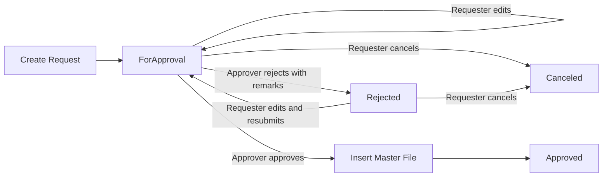

# Filpride Master File Request and Approval Plan

## Goal

Allow every authenticated IBSWeb user to request the creation of selected Filpride master-file records. A request must be approved before its data is inserted into the corresponding master-file table.

The request flow replaces direct creation. Existing master-file administration, including index and edit functionality, remains available to authorized administrators.

## Supported Master Files

The request workflow covers these seven Filpride records:

1. Customer
2. Customer Branch
3. Supplier
4. Bank Account
5. Service
6. Chart of Accounts
7. Pickup Point

Payment Terms and Collection Categories are explicitly excluded.

## Access Rules

- Every authenticated user can submit a request. Submission does not depend on the `Company = Filpride` claim.
- A requester can edit or cancel their own request while it is `ForApproval`.
- A requester can edit their own `Rejected` request. Saving it resubmits the request and returns it to `ForApproval`.
- Only users in the `Admin` or `ManagementAccountingManager` role can approve or reject requests.
- Only one approval is required.
- `Approved` and `Canceled` requests are immutable.
- Existing direct-create actions and pages will be removed so the approval workflow cannot be bypassed.

## Status Lifecycle

## Request Table

Add a `FilprideMasterFileRequest` entity and table with the following fields:

| Field | Purpose |
|------|---------|
| `Id` | Request identifier |
| `MasterFileType` | Allowlisted type identifying one of the seven supported records |
| `PayloadJson` | User-submitted data stored as PostgreSQL `jsonb` |
| `Status` | `ForApproval`, `Approved`, `Rejected`, or `Canceled` |
| `RequestedBy` | Requester's stable user identifier |
| `RequestedByName` | Requester's display name for history and reporting |
| `RequestedDate` | Initial submission timestamp |
| `LastModifiedDate` | Most recent requester edit or resubmission timestamp |
| `ApprovedBy` | Approver's name; null until an approval decision |
| `ApprovedDate` | Approval timestamp; null until approved |
| `Remarks` | Required for rejection and optional for approval |

Configure `Status` as an optimistic concurrency token so simultaneous approval attempts cannot create the same master-file record twice. Add indexes supporting status/date history and type filtering.

`PayloadJson` must contain only allowlisted user-editable values. Database keys, generated record codes, audit fields, timestamps, navigation properties, and UI select lists must not be accepted from the JSON payload.

Customer and supplier TIN values are not unique identifiers. Duplicate TINs must be allowed, including placeholder values such as `000000000000` when the requester has not been given a TIN.

## Supplier Documents

Supplier registration and exemption documents will be uploaded immediately through the existing cloud-storage service. Their saved file names and paths will be included in the supplier request payload.

Files are intentionally retained while requests are pending, approved, rejected, or canceled because they form part of the submitted evidence and audit history. Automatic deletion is deferred until the business defines a formal document-retention policy.

Uploads must still enforce the existing file validation rules and generated safe file names. Replacing a document during request editing stores the replacement and updates the payload; the previous upload remains retained under the same policy.

## Application Structure

### Controller

Add one `MasterFileRequestController` in the Filpride area. It will contain:

- Request index and history
- Request details
- Seven typed GET/POST create action pairs
- Edit and resubmit actions
- Cancel action
- Approve action
- Reject action

All modifying actions require anti-forgery validation. Approval and rejection actions additionally require the `Admin` or `ManagementAccountingManager` role.

### Views

Place the request views under:

`IBSWeb/Areas/Filpride/Views/MasterFileRequest/`

Copy and adapt the existing create forms into this folder. Change their submission targets, back links, headings, buttons, and success messages to describe a request rather than an immediate master-file insertion.

Chart of Accounts requires a request-specific parent-account and account-name form because its current create operation is embedded in the account tree page.

### Service

Add a focused `MasterFileRequestService` in `IBS.Services`. It will:

- Validate and serialize submissions
- Update editable pending or rejected requests
- Enforce request ownership
- Approve through an explicit switch over the seven supported types
- Deserialize only known request payload types
- Rerun uniqueness and foreign-key validation during approval
- Generate master-file codes and derived values during approval
- Insert the target record and update the request atomically
- Preserve existing audit-trail behavior
- Preserve cache invalidation and dependent updates

Do not introduce a generic approval engine, reflection-based type loading, or a new repository abstraction.

## Approval-Time Behavior

Approval must not blindly attach a deserialized EF entity. For each type, the service must recreate the existing insertion behavior:

| Type | Approval responsibilities |
|------|---------------------------|
| Customer | Validate the submitted fields, generate the customer code, and add the audit entry |
| Customer Branch | Confirm the customer still exists, insert the branch, and set the customer's `HasBranch` flag |
| Supplier | Recheck supplier-name rules, use uploaded document paths, generate the supplier code, invalidate relevant cache entries, and audit |
| Bank Account | Recheck account-number and account-name uniqueness and audit |
| Service | Resolve both chart-of-account references, copy their numbers/titles, generate the service number, and audit |
| Chart of Accounts | Recheck the parent, enforce allowed levels, derive account properties, generate the next account number, set the parent's `HasChildren` flag, invalidate the chart cache, and audit |
| Pickup Point | Confirm the supplier still exists, apply created metadata, and audit |

If approval-time validation fails, no target record is inserted and the request remains `ForApproval`. The approver receives a clear validation message so the requester can correct and resubmit it.

## Editing Rules

- Only the original requester can edit the request.
- `ForApproval` and `Rejected` requests are editable.
- Editing a rejected request changes its status to `ForApproval`.
- Resubmission clears `ApprovedBy`, `ApprovedDate`, and the previous rejection `Remarks`.
- The master-file type cannot be changed during editing.
- Server-managed and generated properties cannot be changed through model binding or JSON manipulation.

## Rejection and Cancellation

- Rejection requires non-empty `Remarks`.
- Cancellation is available to the requester for `ForApproval` and `Rejected` requests.
- Cancellation does not delete the request or uploaded supplier documents.
- Rejected and canceled requests remain visible in history.

## Navigation and Dashboard

- Add a user-visible `Master File Requests` navigation entry outside the Admin-only master-file menu.
- Redirect existing master-file Create buttons to the corresponding request actions.
- Add a `Master File Requests` card to Home's Priority Approvals section.
- Show the card and pending count to `Admin` and `ManagementAccountingManager` users.
- Include requests in the requester's `My Submissions` list.
- Include pending requests in approvers' `For Approval` sidebar list.
- Provide pending and searchable historical views in the request controller.

## Direct-Create Removal

Remove the existing direct-create actions and their original create views after the request versions are in place. Update all links and JavaScript endpoints that reference the removed actions.

Keep administrative index and edit actions, with explicit role authorization where needed. Hiding links in the navbar is not sufficient authorization.

## Implementation Order

1. Add request status/type definitions and allowlisted payload models.
2. Add the request entity, `DbSet`, EF configuration, migration, and model snapshot.
3. Implement the request service and approval-time handlers for all seven types.
4. Add `MasterFileRequestController` with submission, editing, cancellation, history, approval, and rejection actions.
5. Copy and adapt the seven request forms into the new view folder.
6. Implement supplier upload persistence and record its paths in the request payload.
7. Replace existing Create links and remove direct-create actions/views.
8. Add navigation, dashboard count/card, `My Submissions`, and `For Approval` integration.
9. Verify authorization, concurrency, audit trails, caches, and all seven insertion paths.

## Verification Checklist

- Every authenticated user can submit each supported request type.
- Submission does not insert into a master-file table.
- Users cannot edit or cancel another user's request.
- Pending requests can be edited without changing status.
- Rejected requests require remarks and return to `ForApproval` after editing.
- Approved and canceled requests cannot be edited.
- Unauthorized users cannot approve or reject requests.
- Either authorized role can complete the single approval.
- Simultaneous approvals result in only one master-file insertion.
- Approval regenerates codes and reruns duplicate checks against current data.
- Supplier documents remain accessible throughout the request lifecycle.
- Approval creates the expected audit entry and performs dependent updates/cache invalidation.
- Direct-create URLs no longer bypass approval.
- Dashboard counts and links show the correct pending requests.
- Pending and historical request lists filter and sort correctly.
- The EF migration and model snapshot match the request schema.
- `dotnet build "Integrated Business System.sln"` succeeds.
